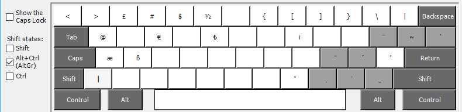
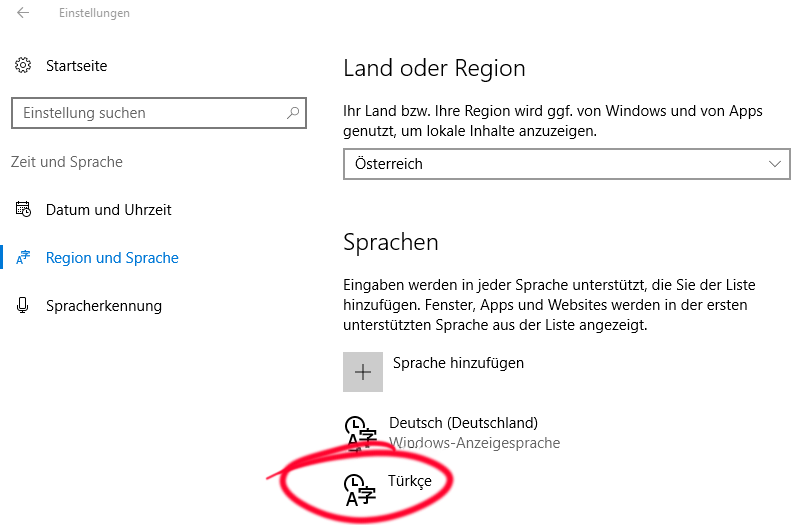
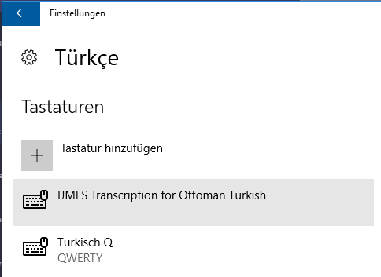
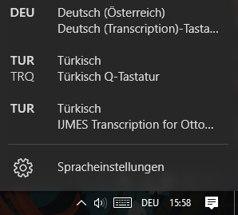

# ota-keyboard
Repo for a Windows input method for ottoman turkish ota-TR keyboard for the QHOD project, created in MS Keyboard Layout Creator

## About

Keyboard created for the transcription of Ottoman sources using the IJMES transcription tables for Windows.

The input method is derived from the standard tr-TR QWERTY Turkish keyboard, with a few additions accessible via combinations with the Right-Alt <kbd>Alt-Gr</kbd> key to add diacritics (glyph coverage see below).

In the Alt-Gr/Alt-Cmd/Right-Alt shift state, we add *dead keys*: 

- <kbd>Alt-Gr</kbd> + <kbd>,</kbd>: Combining dot below ( ̣, works with HhKkSsTtZz) 
- <kbd>Alt-Gr</kbd> + <kbd>.</kbd>: Combining dot above ( ̇, works with HhSsTtZz) 
- <kbd>Alt-Gr</kbd> + <kbd>-</kbd>: Combining macron below ( ̱, works with NnZz). **Note**: As MSKLC is not able to create combined characters that do not have a single codepoint in Unicode, S̠s̠ has to be typed as <kbd>S</kbd> + <kbd>Alt-Gr</kbd> + <kbd>-</kbd> + <kbd>space</kbd>
- <kbd>Alt-Gr</kbd> + <kbd>l</kbd>: Combining macron above ( ̄, works with AaEeİIiıOoUuYy) 

And normal keys

- <kbd>Alt-Gr</kbd> + <kbd>ä</kbd> for <kbd>ʿ</kbd>
- <kbd>Alt-Gr</kbd> + <kbd>Shift</kbd> + <kbd>ä</kbd> for <kbd>ʾ</kbd>

As some applications already use this keyboard position for other purposes, the ʿ and ʾ letters are additionally available as 

- <kbd>Alt-Gr</kbd> + <kbd>m</kbd> for <kbd>ʿ</kbd>
- <kbd>Alt-Gr</kbd> + <kbd>Shift</kbd> + <kbd>m</kbd> for <kbd>ʾ</kbd>

**Caveat**: Due to strange behaviour on Windows 10’s side, the <kbd>CapsLock</kbd> is not working in combination with the combining macron keys derived from <kbd>Alt-Gr</kbd> + <kbd>-</kbd>. So, if you want to type ẔẕṈṉ or just ̱ : avoid <kbd>CapsLock</kbd>. 

## Glyph coverage

The keyboard includes the following special characters. 

ʾʿ  
ḢḣḤḥ  
Ḳḳ  
̠Nn̠  
ṠṡṢṣ̠Ss̠
ṪṫṬṭ  
ŻżẒẓ̠Z̠z̠  
ĀāĒēĪīŌōŪūȲȳīĪ  

## Installation

1. Use the provided windows installer files (see [Releases](https://github.com/QHOD/ota-keyboard/releases)).
2. In Windows Settings (Languages > Region), add Turkish as a Language. 

3. Select Turkish/Türkce Language > Options and add Keyboard from the list as in 

4. Select the IJMES keyboard using the input method selection in Windows’ menu bar as in 

4. Type ahead. 
5. If it does not work, try rebooting Windows.

### Updating / Customization using MSKLC when `ota-keyboard` is already installed

If nothing else works (e.g. you get an error during re-installation that the IJMES keyboard is already installed), try a combination of the following: 

- remove the IJMES keyboard from the input methods (reverse the steps noted above) in the system preferences
- reboot Windows
- remove the Registry entry for the `dll` file (in `regedit.exe` look for "IJMES.dll" in  `HKEY_LOCAL_MACHINE\SYSTEM\CurrentControlSet\Control\Keyboard Layouts\`)
- remove the `IJMES.dll` file itself from `@%SystemRoot%\system32\IJMES.dll` (typically, this is in `C:\Windows\system32\`)

## Customization 

Using MS Keyboard Layout Creator: 

1. Get MSKLC.exe from the interwebs, e.g. from <a href="https://www.microsoft.com/en-us/download/details.aspx?id=102134">Microsoft</a>.
2. Try if it works  
    a. You're fine.  
    b. You have to install the ancient .NET 2.0 framework. [Useful info on how to do this](https://www.windows-faq.de/2016/10/30/net-framework-2-0-und-3-5-unter-windows-10-installieren/) (in German)  
    **Hint:** To my experience, MSKLC.exe runs just fine under Wine, if you need to do this under a non-Windows Operating System.  
    To this end: i. unpack the "outer" MSKLC.exe self extracting archive, ii. run setup.exe to install, iii. run MSKLC.exe from where you installed it.
3. Open the `ijmes.klc` file and change it until it suits your needs. 
4. Recompile the `.dll` (likely you will have to uninstall the previous version to avoid naming clash)

## Notes on porting the ota-keyboard to other operating systems (Linux, Mac)

I tried to implement this in a cross-platform manner at first using [Keyman](https://keyman.com/) but was unsuccessful.

### Linux

- <https://coffeeplusplus.z11.de/klc2xmodmap/xmodmap2.php> offers a php scritp to convert from klc to xmodmap, but this does not include dead keys (which would be crucial to this particular keyboard). 
- <http://linux.lsdev.sil.org/wiki/index.php/Conversion_from_Microsoft_KLC> shows the necessary steps to go from `klc` to `xdb` with a suggestion for a regex based solution, which is implemented in 
- <https://github.com/alexriss/keyboard-layout-converter> a Python converter based on this regex. Both do not include dead keys, either. 

### Mac

If anyone is able to port this to [Ukelele](https://software.sil.org/ukelele/) or [Karabiner](https://karabiner-elements.pqrs.org/), it should not be a big problem. No Mac available here. 

### Alternatives to ota-keyboard

- A similar effort with slightly different key bindings and transcription alphabet is available from <http://www.oncu.com/osmtransklavye/>. They do not publish the source `.klc` files, yet offer variants for both the Turkish Q and F keyboards – Windows only as they use the same MSKLC tool. 
- Consider using web based entry methods such as, e.g. <https://www.lexilogos.com/keyboard/ottoman_turkish.htm> or <http://www.umich.edu/~turkish/links/keyboard/klavye.htm>. 

